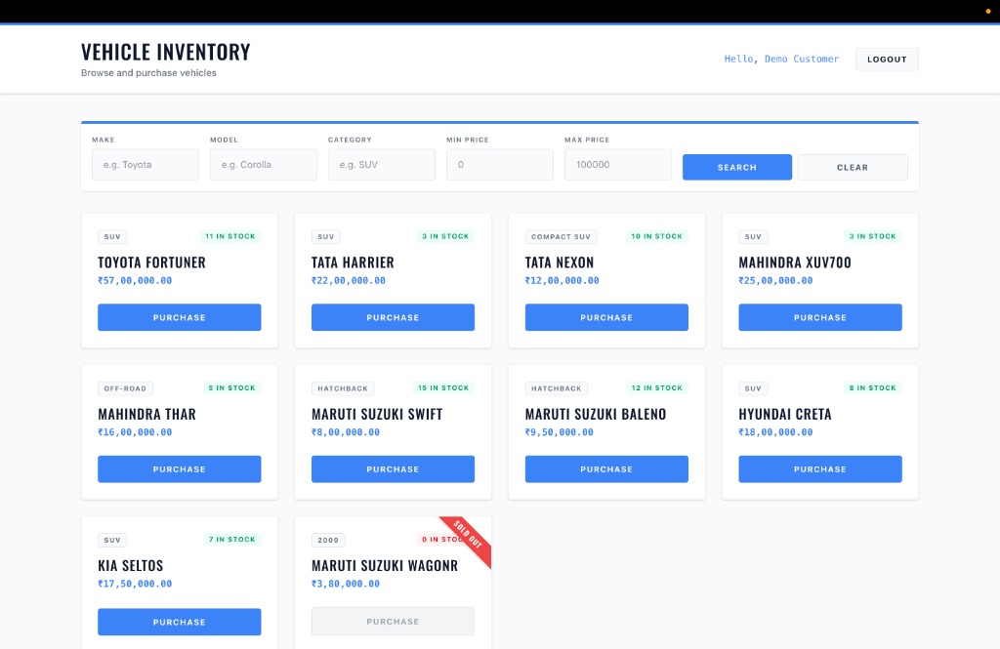
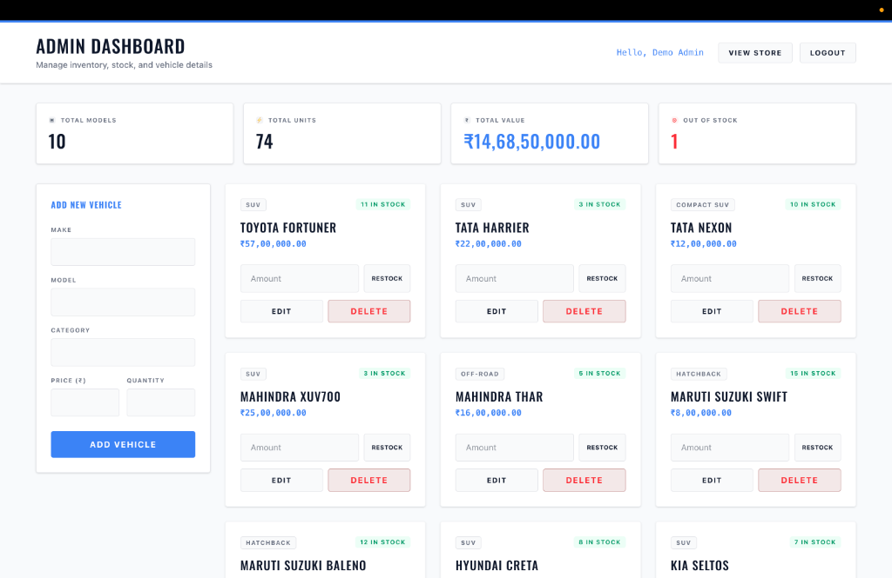
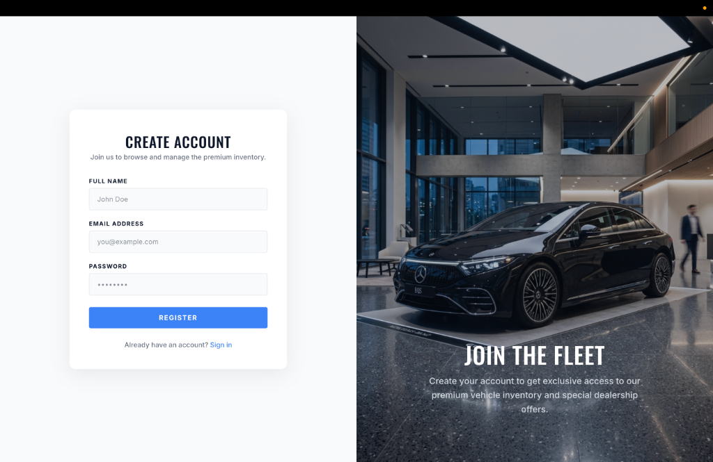
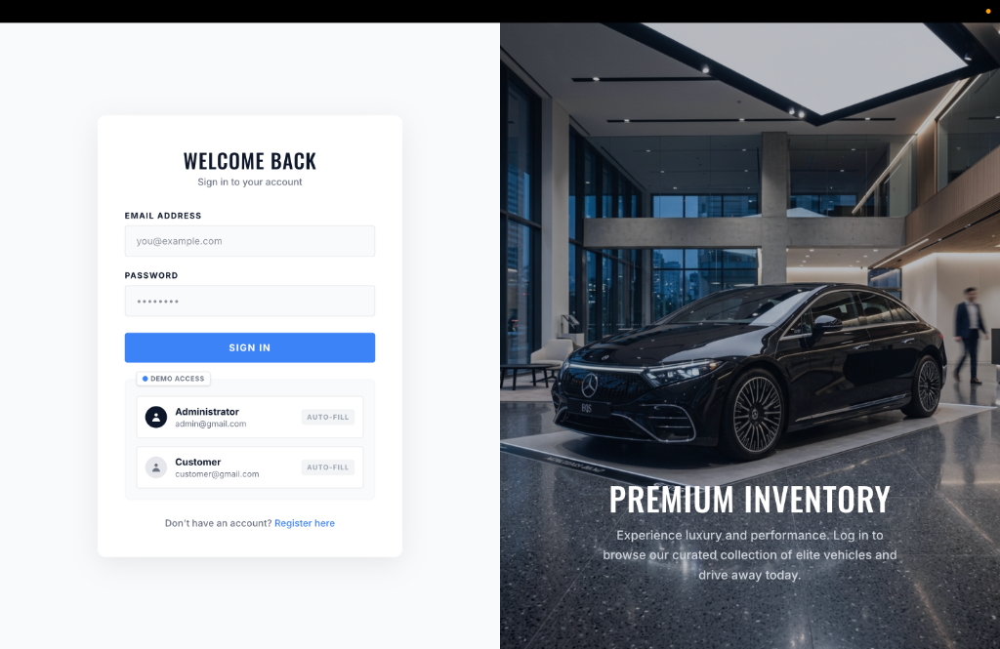

# 🚗 Car Dealership Inventory System

**🚀 Live Demo:** [View on Vercel](https://pankilpanchal27-car-dealership-system.vercel.app/)

A full-stack Car Dealership Inventory System built with **Node.js/TypeScript + Express + MongoDB** on the backend and **React + Vite + Tailwind CSS** on the frontend. Built following strict **Test-Driven Development (TDD)** with a Red → Green → Refactor commit discipline.

---

## Screenshots

> _Run the app locally and use the steps below to see it in action._

### Customer View


### Admin Dashboard


### Authentication Pages

<br>


---

## Tech Stack

| Layer | Technology |
|---|---|
| Backend | Node.js, TypeScript, Express 5, Mongoose, JWT, Zod, bcrypt |
| Database | MongoDB (local dev) / MongoDB Atlas (production) |
| Frontend | React 19, Vite, TypeScript, Tailwind CSS v4 |
| Testing (BE) | Jest, Supertest, mongodb-memory-server |
| Testing (FE) | Vitest, @testing-library/react |

---

## Features

### Auth
- Register (POST `/api/auth/register`) — hashes password with bcrypt, returns user object
- Login (POST `/api/auth/login`) — validates credentials, returns signed JWT

### Vehicles (JWT protected)
- **GET** `/api/vehicles` — list all vehicles
- **GET** `/api/vehicles/search` — filter by `make`, `model`, `category`, `minPrice`, `maxPrice`
- **POST** `/api/vehicles` — add new vehicle
- **PUT** `/api/vehicles/:id` — update vehicle details
- **DELETE** `/api/vehicles/:id` _(Admin only)_ — remove vehicle

### Inventory (JWT protected)
- **POST** `/api/vehicles/:id/purchase` — decrement stock by `quantity`
- **POST** `/api/vehicles/:id/restock` _(Admin only)_ — increment stock by `quantity`

### Frontend
- User registration and login with token persistence
- Dashboard with live vehicle grid (responsive, 1–4 columns)
- Filter by make, model, category, price range; clear filters
- Purchase button — **disabled when stock is 0** ("Out of Stock")
- Admin badge in Navbar, admin-only **Add Vehicle** button, **Edit** and **Delete** per card
- Loading skeleton grid, empty-state messaging, error banners

---

## Project Setup

### Prerequisites
- Node.js ≥ 18
- MongoDB running locally on `mongodb://127.0.0.1:27017` (or update `.env`)

### 1. Clone & install

```bash
git clone <your-repo-url>
cd Car-Dealership-System

# Backend
cd backend
npm install

# Frontend
cd ../frontend
npm install
```

### 2. Configure environment

**Backend** — create `backend/.env`:
```env
PORT=8000
MONGODB_URI=mongodb://127.0.0.1:27017/car-dealership
JWT_SECRET=your_super_secret_key_here
```

**Frontend** — create `frontend/.env`:
```env
VITE_API_BASE_URL=http://localhost:8000/api
```

### 3. Run locally

```bash
# Terminal 1 — Backend
cd backend
npm run dev

# Terminal 2 — Frontend
cd frontend
npm run dev
```

Visit `http://localhost:5173`

### 4. Create an admin user

Register normally via the UI, then update your user's role in MongoDB:

```bash
mongosh
use car-dealership
db.users.updateOne({ email: "your@email.com" }, { $set: { role: "admin" } })
```

---

## Deployment

The application is configured for easy deployment on **Vercel** (Frontend) and **Render** (Backend).

### Backend (Render)
- The project includes a `render.yaml` blueprint at the root.
- Simply connect the repository to Render and deploy as a Blueprint.
- Ensure you set `MONGODB_URI`, `JWT_SECRET`, and `NODE_VERSION=20` in the Render dashboard.

### Frontend (Vercel)
- The project includes `frontend/vercel.json` for SPA routing.
- Connect the project to Vercel.
- Set the `VITE_API_BASE_URL` environment variable to your Render backend URL (e.g., `https://your-backend.onrender.com/api`).

---

## Running Tests

### Backend

```bash
cd backend
npm test
```

Expected output: **21 tests, 12 suites — all passing**

### Frontend

```bash
cd frontend
npm test -- --run
```

Expected output: **41 tests, 15 suites — all passing**

---

## Test Report

### Backend (Jest + Supertest)

| Suite | Tests | Status |
|---|---|---|
| Health Check (`app.test.ts`) | 1 | ✅ Pass |
| POST /api/auth/register | 2 | ✅ Pass |
| POST /api/auth/login | 3 | ✅ Pass |
| GET /api/vehicles | 1 | ✅ Pass |
| GET /api/vehicles/search | 4 | ✅ Pass |
| POST /api/vehicles | 1 | ✅ Pass |
| PUT /api/vehicles/:id | 1 | ✅ Pass |
| DELETE /api/vehicles/:id | 1 | ✅ Pass |
| POST /api/vehicles/:id/purchase | 1 | ✅ Pass |
| POST /api/vehicles/:id/restock | 1 | ✅ Pass |
| Auth Middleware | 1 | ✅ Pass |
| Admin Middleware | 4 | ✅ Pass |
| **Total** | **21** | **✅ All Pass** |

### Frontend (Vitest + Testing Library)

| Suite | Tests | Status |
|---|---|---|
| API client (`api.test.ts`) | 2 | ✅ Pass |
| Auth service | 2 | ✅ Pass |
| Vehicle service | 1 | ✅ Pass |
| AuthContext | 3 | ✅ Pass |
| ProtectedRoute | 1 | ✅ Pass |
| Navbar | 5 | ✅ Pass |
| SearchBar | 2 | ✅ Pass |
| VehicleCard | 5 | ✅ Pass |
| VehicleList | 2 | ✅ Pass |
| AddVehicleModal | 4 | ✅ Pass |
| EditVehicleModal | 4 | ✅ Pass |
| Login page | 1 | ✅ Pass |
| Register page | 1 | ✅ Pass |
| Dashboard | 6 | ✅ Pass |
| App routing | 2 | ✅ Pass |
| **Total** | **41** | **✅ All Pass** |

---

## TDD Commit Strategy

Every feature follows **Red → Green → Refactor**:

1. **RED** — Write a failing test that describes the desired behavior. Commit with `test: ...`
2. **GREEN** — Write the minimal implementation that makes the test pass. Commit with `feat: ...`
3. **REFACTOR** — Clean up code, improve design without breaking tests. Commit with `refactor: ...`

Each commit message includes:
```
Co-authored-by: Antigravity <AI@users.noreply.github.com>
```

---

## My AI Usage

### Tools Used
- **Antigravity IDE (Gemini / Claude Sonnet 4.6)** — the primary AI assistant used throughout this project

### How I Used AI

| Activity | How AI Was Used |
|---|---|
| **Architecture planning** | Discussed the overall backend structure (controllers/services/routes/middleware pattern) and frontend component hierarchy |
| **TDD scaffolding** | AI helped generate initial RED test cases for each feature, which I then verified would fail before implementing |
| **Code generation** | Generated boilerplate for Express routes, Mongoose schemas, React components, and Tailwind UI |
| **Debugging** | Used AI to identify the issue with Tailwind v4's `@import "tailwindcss"` syntax, JWT decoding on client side, and test mock patterns |
| **Refactoring** | Asked AI to refactor controllers, clean up error handling, and improve UI design systematically |
| **Documentation** | AI drafted README structure and PROMPTS.md |

### My Reflection

AI dramatically accelerated the scaffolding phase — what would have taken hours of boilerplate setup was done in minutes. However, **I remained in the driver's seat**: I reviewed every generated file, corrected test expectations, adjusted business logic (e.g. the `minPrice`/`maxPrice` MongoDB `$gte/$lte` filter), and made deliberate design decisions (e.g. decoding JWT client-side only for UI role checks, not for auth).

The TDD workflow was particularly valuable here — the AI-generated tests served as a spec that kept me honest. When the UI redesign broke 3 tests, it immediately surfaced the regression, which I fixed promptly.

AI is a force multiplier, not a replacement for engineering judgment.

---

## Project Structure

```
Car-Dealership-System/
├── backend/
│   ├── src/
│   │   ├── config/        # MongoDB connection
│   │   ├── controllers/   # auth.controller, vehicle.controller
│   │   ├── middleware/     # auth.middleware, admin.middleware
│   │   ├── models/        # User, Vehicle (Mongoose schemas)
│   │   ├── routes/        # auth.routes, vehicle.routes
│   │   ├── services/      # auth.service, vehicle.service
│   │   └── tests/         # Jest integration tests (21 tests)
│   └── server.ts
├── frontend/
│   ├── src/
│   │   ├── api/           # Axios client with JWT interceptor
│   │   ├── components/    # Navbar, SearchBar, VehicleCard, VehicleList, Modals
│   │   ├── context/       # AuthContext, AuthProvider, useAuth
│   │   ├── pages/         # Login, Register, Dashboard
│   │   └── services/      # authService, vehicleService
│   └── index.html
├── README.md
└── PROMPTS.md
```
